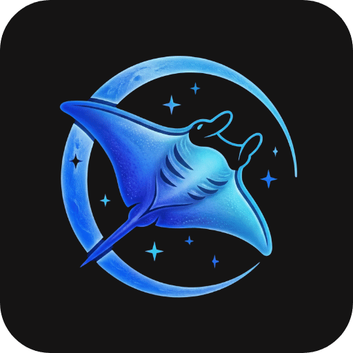

# MantaTools

**Your Steam library, supercharged.**

 

[**Download**](https://github.com/MantaTools/mantatools-download/releases/latest) · [**Website**](https://mantagames.id) · [**Tutorial**](https://mantagames.id/tutorials)

 

## Apa itu MantaTools?

MantaTools adalah desktop app untuk mengelola dan menambahkan game ke Steam library kamu.
Beli produk di [mantagames.id](https://mantagames.id), login di app, dan semua game langsung tersedia.

 

## Fitur

<table>
<tr>
<td width="50" align="center">📚</td>
<td><strong>Catalogue</strong> — Jelajahi koleksi game lengkap dengan filter Genre, Tags, Developer, dan Publisher.</td>
</tr>
<tr>
<td align="center">🎮</td>
<td><strong>Add to Steam</strong> — Tambahkan game ke Steam library dengan satu klik. Auto-sync dengan akun Steam kamu.</td>
</tr>
<tr>
<td align="center">👥</td>
<td><strong>Multiplayer Fix</strong> — 1,752+ game multiplayer tersedia. Download fix dan main bareng teman.</td>
</tr>
<tr>
<td align="center">🛡️</td>
<td><strong>Denuvo Activation</strong> — Aktivasi game Denuvo langsung dari app. Support multiple Steam account.</td>
</tr>
<tr>
<td align="center">🔓</td>
<td><strong>Game Bypass</strong> — Bypass launcher Activision, EA, Rockstar, Ubisoft, dan lainnya.</td>
</tr>
<tr>
<td align="center">⬆️</td>
<td><strong>Upgrade Plan</strong> — Upgrade plan langsung dari app — bayar selisih harga aja.</td>
</tr>
<tr>
<td align="center">🔄</td>
<td><strong>Auto-Update</strong> — App selalu up-to-date. Progress download ditampilkan realtime.</td>
</tr>
</table>

 

## Instalasi

1. Download **[mantatools-2.2.2-setup.exe](https://github.com/MantaTools/mantatools-download/releases/latest)** dari halaman Releases
2. Jalankan installer
3. Login dengan Order ID dari [mantagames.id](https://mantagames.id)
4. Selesai — jelajahi catalogue dan tambahkan game ke Steam

> [!WARNING]
> Matikan **Windows Defender / Antivirus** sebelum menggunakan fitur Multiplayer Fix dan Game Bypass.

 

## System Requirements

| | Minimum |
|---|---|
| **OS** | Windows 10 / 11 (64-bit) |
| **RAM** | 4 GB |
| **Storage** | 200 MB (app only) |
| **Internet** | Diperlukan untuk login & sync |
| **Steam** | Harus terinstall |

 

## Changelog

### v2.2.2 — Multiplayer Update `Latest`
> 17 Feb 2026

- Multiplayer catalogue expanded to 1,752 games
- Real-time extraction progress reporting
- Warning bar: disable antivirus before applying fix
- Fixed: false 'Update Available' after Add to Steam

### v2.2.1 — Catalogue Overhaul
> 13 Feb 2026

- Cleaner catalogue: only real games, no more DLCs/demos/playtests
- Filter by Tags, Developers, Publishers, and Tier
- Randomized Hot Now games on every app launch

### v2.2.0 — DRM: Denuvo & Bypass
> 12 Feb 2026

- Denuvo badge on game cards
- Game Requirements modal for Denuvo-protected games
- Denuvo Activation: Multiple Steam accounts with account selector
- Bypass: Game-specific notes (e.g. launch options)

&nbsp;<strong>Older versions</strong>

 

### v2.1.9 — Upgrade Plan Improvements
> 7 Feb 2026

- Fixed: Games from 'Claim Your Game Here' section not appearing
- Limited-time upgrade discount with countdown timer
- Show all plans with current plan highlighted
- Improved Upgrade Plan page UI

### v2.1.8 — Upgrade Plan
> 6 Feb 2026

- Upgrade plan directly from the app with discounted price
- Only pay the price difference from your current plan
- Restart App button after successful upgrade

### v2.1.7 — Stability Fix
> 6 Feb 2026

- Auto-retry dengan smart delay jika request gagal
- Request deduplication — tidak ada duplicate request
- Auto-cancel request lama saat pindah game

### v2.1.6
> 5 Feb 2026

- Library sync now removes uninstalled games
- Fixed Surprise Me button not showing game details
- Auto-update now shows download progress, size, and speed

 

## FAQ

&nbsp;<strong>App tidak bisa dibuka / terdeteksi virus?</strong>

 
Ini false positive. Tambahkan folder MantaTools ke exclusion list Windows Defender:
  
<code>Settings → Privacy & Security → Virus & threat protection → Exclusions → Add folder</code>
  

&nbsp;<strong>Login gagal / "Invalid Order ID"?</strong>

 
Pastikan Order ID yang dimasukkan benar (dari email konfirmasi pembelian di mantagames.id). Satu Order ID hanya bisa digunakan di satu device.
  

&nbsp;<strong>Game tidak muncul di Steam setelah "Add to Steam"?</strong>

 
Restart Steam setelah menambahkan game. Pastikan Steam sedang berjalan saat proses Add to Steam.
  

&nbsp;<strong>Multiplayer fix / Bypass gagal?</strong>

 
Matikan Windows Defender dan antivirus lainnya sebelum mendownload dan mengekstrak fix. Antivirus sering memblokir atau menghapus file yang diperlukan.
  

 

---

**[mantagames.id](https://mantagames.id)**

Made with ☕ in Indonesia

