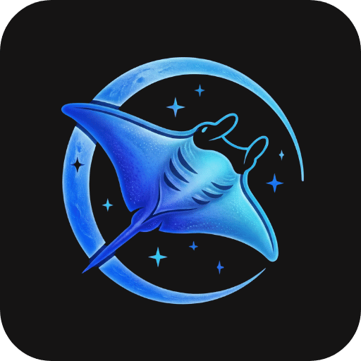

# MantaTools

**Your Steam library, supercharged.**

 

[**Download**](https://github.com/MantaTools/mantatools-download/releases/latest) · [**Website**](https://mantagames.id) · [**Tutorial**](https://mantagames.id/tutorials)

 

## Apa itu MantaTools?

MantaTools adalah aplikasi desktop untuk mengelola dan menambahkan game ke Steam library Anda.
Beli produk di [mantagames.id](https://mantagames.id), login di aplikasi, dan game Anda langsung tersedia.

Game dari MantaTools ditujukan untuk dimainkan **offline (single-player)**.

 

## Fitur

<table>
<tr>
<td width="50" align="center">📚</td>
<td><strong>Catalogue</strong>: jelajahi koleksi game lengkap dengan filter Genre, Tags, Developer, dan Publisher.</td>
</tr>
<tr>
<td align="center">🎮</td>
<td><strong>Add to Steam</strong>: tambahkan game ke Steam library dengan satu klik. Auto-sync dengan akun Steam Anda.</td>
</tr>
<tr>
<td align="center">🕹️</td>
<td><strong>Fokus Main Offline</strong>: game dimainkan offline (single-player). Untuk sebagian game tersedia opsi multiplayer lewat server online-fix, bukan server resmi Steam, sehingga tidak bisa bermain bersama pemain Steam resmi dan koneksinya tidak dijamin stabil.</td>
</tr>
<tr>
<td align="center">🛡️</td>
<td><strong>Denuvo Activation</strong>: aktivasi game Denuvo sendiri langsung dari aplikasi lewat tombol Generate Denuvo Token, tanpa tiket atau admin (sesuai paket Anda).</td>
</tr>
<tr>
<td align="center">🔓</td>
<td><strong>Game Bypass</strong>: bypass launcher Activision, EA, Rockstar, Ubisoft, dan lainnya.</td>
</tr>
<tr>
<td align="center">⬆️</td>
<td><strong>Upgrade Plan</strong>: upgrade plan langsung dari aplikasi, cukup bayar selisih harga. Bonus Denuvo Access hanya berlaku untuk pembelian Premium Bundle langsung di website, tidak untuk upgrade lewat aplikasi.</td>
</tr>
<tr>
<td align="center">💻</td>
<td><strong>Reset Device</strong>: pindah PC? Lepaskan Order ID dari PC lama sendiri di <a href="https://mantagames.id/unbind">mantagames.id/unbind</a>.</td>
</tr>
<tr>
<td align="center">🔄</td>
<td><strong>Auto-Update</strong>: aplikasi selalu up-to-date. Progress download ditampilkan realtime.</td>
</tr>
</table>

 

## Instalasi

1. Download installer terbaru (`mantatools-x.y.z-setup.exe`) dari **[halaman Releases](https://github.com/MantaTools/mantatools-download/releases/latest)**
2. Jalankan installer
3. Login dengan Order ID dari [mantagames.id](https://mantagames.id)
4. Selesai, jelajahi catalogue dan tambahkan game ke Steam

> [!WARNING]
> Tambahkan folder game ke exclusion list antivirus (atau matikan Windows Defender sementara) sebelum memakai fitur Game Bypass atau Multiplayer Fix.

 

## System Requirements

| | Minimum |
|---|---|
| **OS** | Windows 10 / 11 (64-bit) |
| **RAM** | 4 GB |
| **Storage** | 200 MB (app only) |
| **Internet** | Diperlukan untuk login & sync |
| **Steam** | Harus terinstall |

 

## Catatan Rilis

Catatan rilis setiap versi ada di **[halaman Releases](https://github.com/MantaTools/mantatools-download/releases)**. Aplikasi memperbarui dirinya sendiri secara otomatis.

 

## FAQ

&nbsp;<strong>App tidak bisa dibuka / terdeteksi virus?</strong>

 
Ini false positive. Tambahkan folder MantaTools ke exclusion list Windows Defender:
  
<code>Settings → Privacy & Security → Virus & threat protection → Exclusions → Add folder</code>
  

&nbsp;<strong>Login gagal / "Invalid Order ID"?</strong>

 
Pastikan Order ID yang dimasukkan benar (dari email konfirmasi pembelian di mantagames.id). Satu Order ID hanya aktif di satu device dalam satu waktu.
  

&nbsp;<strong>Pindah PC atau Order ID aktif di perangkat lain?</strong>

 
Lepaskan Order ID dari PC lama sendiri di <a href="https://mantagames.id/unbind">mantagames.id/unbind</a> memakai Order ID dan email pembelian, lalu login lagi. Gratis, maksimal 5 kali per Order ID dengan jeda 7 hari antar reset. Ganti SSD saja tidak memutus ikatan device.
  

&nbsp;<strong>Apakah game bisa dimainkan online?</strong>

 
Game dari MantaTools ditujukan untuk dimainkan offline (single-player) dan tidak terhubung ke server online resmi Steam. Opsi multiplayer untuk sebagian game berjalan lewat server online-fix, bukan server resmi Steam, dan tidak dijamin stabil. Jika ingin bermain online di server resmi, beli game-nya langsung di Steam.
  

&nbsp;<strong>Game tidak muncul di Steam setelah "Add to Steam"?</strong>

 
Restart Steam setelah menambahkan game. Pastikan Steam sedang berjalan saat proses Add to Steam.
  

&nbsp;<strong>Multiplayer Fix / Bypass gagal?</strong>

 
Tambahkan folder game ke exclusion list antivirus, atau matikan Windows Defender sementara, sebelum menerapkan fix. Antivirus sering memblokir atau menghapus file yang diperlukan.
  

 

---

**[mantagames.id](https://mantagames.id)**

Made with ☕ in Indonesia

